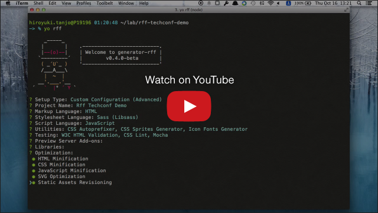

# generator-rff

> Fully customizable Yeoman generator for scaffolding a front-end web app.

[![NPM Version][npm-image]][npm-url]
[![Build Status][travis-image]][travis-url]
[![Dependency Status][deps-image]][deps-url]

## Demo
[](http://youtu.be/jGzqR6-jAYE)

## Features

### Supported Languages
* **Markup**
  * HTML
  * Jade
* **Stylesheet**
  * CSS
  * Sass (Ruby)
  * Sass (Libsass)
  * Less
  * Stylus
* **Script**
  * JavaScript
  * CoffeeScript

### Tasks and Functions
* **Utilities**
  * Wiring up Bower Components (Built-in)
  * CSS Autoprefixer
  * CSS Sprites Generator
  * Icon Fonts Generator
* **Testing**
  * W3C HTML Validation
  * CSS Lint
  * JSHint
  * JSCS
  * Mocha
  * Jasmine
* **Preview Server**
  * BrowserSync (Built-in)
  * SSI Support
* **Support Libraries**
  * Modernizr
* **Optimization**
  * Image Optimization (Built-in)
  * HTML Minification
  * CSS Minification
  * JavaScript Minification
  * SVG Optimization
  * Static Assets Revisioning
* **Distribution**
  * Deployment to Git Repository
  * Deployment over FTP

## Getting Started
Make sure you have [Node.js](http://nodejs.org/) and [yo](https://github.com/yeoman/yo) installed:

```shell
$ npm install -g yo
```

To install generator-rff, run:

```shell
$ npm install -g generator-rff
```

Make a new directory, and cd into it:

```shell
$ mkdir my-new-project && cd $_
```

Finally, initiate the generator:

```shell
$ yo rff
```

## Generator Options
* `-s`, `--skip-install`  
  Skips the automatic execution of `bower` and `npm` after scaffolding has finished.

* `--config=<type>`  
  Setup type. If specified, the first prompt will be skipped.  
  You can set `standard`, `minimum`, `user` or `custom`.

* `--skip-welcome-message`  
  Skips app welcome message.

* `--skip-install-message`  
  Skips app installation message.

## See Also
* [Yeoman](http://yeoman.io/) : Modern workflows for modern webapps
* [Grunt](http://gruntjs.com/) : The JavaScript task runner
* [Bower](http://bower.io/) : Package manager for the web

## License
Copyright (c) 2014-2016 Rakuten, Inc.
Licensed under the [MIT License](LICENSE).

[npm-image]: https://img.shields.io/npm/v/generator-rff.svg
[npm-url]: https://www.npmjs.com/package/generator-rff
[travis-image]: https://travis-ci.org/rakuten-frontend/generator-rff.svg?branch=master
[travis-url]: https://travis-ci.org/rakuten-frontend/generator-rff
[deps-image]: https://david-dm.org/rakuten-frontend/generator-rff.svg
[deps-url]: https://david-dm.org/rakuten-frontend/generator-rff
